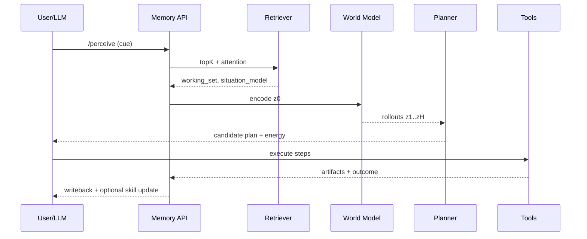

# BRAIN — BruceAI Neural Memory + Motor

> **Tagline:** *Talk like a poet. Think like a pilot. Remember like a parent. Move like a motor.*
>
> **Status:** Design blueprint you can ship in phases today. Ambitious, not sci‑fi.

   

---

## TL;DR (no fluff)

* Store **episodes** (what/where/when), **semantics** (facts/relations), **skills** (policies), and **feelings/valuation** (salience/reward).
* Retrieve with a **“laser cortex”**: mass-parallel similarity (vector search) → attention pool → graph hops → write a compact **situation model**.
* Reason and plan in **latent space** (not tokens) with a lightweight world model. Compile repeated plans into **skills** (reflex policies).
* Treat compute/latency/cost as **energy (ATP)** and make the planner budget for it. Sleep nightly to **consolidate**, **prune**, and **distill**.
* LLM = interface + tool-use; **world model + memory + planner** = brain.

---

## Contents

1. [Why this exists](#why-this-exists)
2. [System at 10,000 ft](#system-at-10000-ft)
3. [Core data model](#core-data-model)
4. [Memory types](#memory-types)
5. [Retrieval: the Laser Cortex](#retrieval-the-laser-cortex)
6. [Reasoning & Planning (Latent System‑2)](#reasoning--planning-latent-system2)
7. [Energy-as-Motor](#energy-as-motor)
8. [Sleep: Consolidation & Dreaming](#sleep-consolidation--dreaming)
9. [APIs (v0)](#apis-v0)
10. [Reference pipeline (Mermaid)](#reference-pipeline-mermaid)
11. [Repo layout](#repo-layout)
12. [Quickstart (local dev)](#quickstart-local-dev)
13. [Eval & telemetry](#eval--telemetry)
14. [Security & privacy](#security--privacy)
15. [Legal: license + ethical use](#legal-license--ethical-use)
16. [Roadmap](#roadmap)
17. [Images & prompts](#images--prompts)
18. [Contributing](#contributing)

---

## Why this exists

Chat logs aren’t memory. Token prediction isn’t physics. If BruceAI is going to feel alive—**present, useful, and sane**—it needs a brain: a **persistent, multimodal memory**, a **world model** to imagine futures, a **planner** to choose actions, and a **motor** to budget energy.

> **Design goal:** *When something happens (e.g., “Alexandria jumps into the pool”), BRAIN lights up all similar memories, predicts likely outcomes, picks a plan (towel/camera/safety), acts, and learns—fast.*

---

## System at 10,000 ft

```mermaid
flowchart LR
  subgraph Perception
    A[Text/Audio/Video/Sensors]
    E[Encoders: CLIP/Whisper/ViT]
  end
  subgraph Memory
    V[(Vector Store\npgvector/LanceDB)]
    G[(Graph DB\nNeo4j)]
    O[(Object Store\nS3/FS)]
  end
  subgraph Working
    R[Attention Pool\n+ Hopfield update]
    S[Situation Model\n(latent state)]
  end
  subgraph Cognition
    W[World Model\n(latent dynamics)]
    P[Planner\nMPC / CEM / beam]
    K[Skills\n(policy graphs)]
  end
  subgraph Motor
    C[Controllers & Tools\n(ffmpeg, search, agents)]
    M[Energy Budgeter\n(cost/latency/quotas)]
  end

  A-->E-->V
  E-->O
  V<-->R
  G<-->R
  R-->S-->W-->P
  K<-->P
  P-->C
  M--constraints-->P
  C-->O
  P-->V
  P-->G
```

**LLM sits beside this graph** as the conversational/controller layer: it frames goals, calls retrieval/planning APIs, and explains outcomes. It is *not* the physics brain.

---

## Core data model

> One spine, two sidecars. Simple, scalable, and durable.

### Spine: Postgres (+ pgvector)

```sql
CREATE EXTENSION IF NOT EXISTS vector;

CREATE TABLE events (
  id UUID PRIMARY KEY,
  t timestamptz NOT NULL,
  who TEXT[],
  what TEXT[],
  where_ TEXT[],
  context JSONB,
  importance REAL DEFAULT 0.0,
  reward REAL DEFAULT 0.0,
  outcome TEXT,
  embedding vector(1024)
);
CREATE INDEX ON events USING ivfflat (embedding vector_cosine_ops);
CREATE INDEX ON events (t);

CREATE TABLE snippets (
  id UUID PRIMARY KEY,
  event_id UUID REFERENCES events(id) ON DELETE CASCADE,
  modality TEXT CHECK (modality IN ('text','audio','image','video')),
  uri TEXT NOT NULL,
  span JSONB -- e.g., {"start":12.0, "end":18.0}
);

CREATE TABLE skills (
  id UUID PRIMARY KEY,
  name TEXT UNIQUE,
  description TEXT,
  pre JSONB,
  steps JSONB,      -- array of tool invocations / guards
  post JSONB,
  embedding vector(768),
  uses INT DEFAULT 0,
  success REAL DEFAULT 0.0
);

CREATE TABLE metrics (
  key TEXT PRIMARY KEY,
  val JSONB,
  updated timestamptz DEFAULT now()
);
```

### Sidecar: Graph (Neo4j / Memgraph)

* **Nodes:** `Person, Place, Object, Idea, Skill`
* **Edges:** `KNOWS, LOCATED_IN, CAUSES, PART_OF, USED_FOR, SIMILAR`
* **Properties:** `weight, t_first, t_last, source`

Example constraints:

```cypher
CREATE CONSTRAINT person_name IF NOT EXISTS FOR (p:Person) REQUIRE p.name IS UNIQUE;
CREATE INDEX rel_weight IF NOT EXISTS FOR ()-[r:SIMILAR]-() ON (r.weight);
```

### Sidecar: Object store

* Raw artifacts (audio/video/images/text). Content-addressed with SHA-256; referenced by `snippets.uri`.

---

## Memory types

* **Episodic:** time-stamped events with embeddings and media refs.
* **Semantic:** graph facts about people/places/objects/ideas.
* **Procedural:** named policy graphs (pre→steps→post) with embeddings.
* **Affective/valuation:** `importance`, `reward`, `salience`, recency decay.

> **Rule:** every write updates *at least* one of each—episode, facts, or skills—so the system always has a scene, meanings, and a way to act.

---

## Retrieval: the Laser Cortex

Mass-parallel **content-addressable** recall that feels like shining a beam into a sphere of cells.

**Steps:**

1. **Top‑K per modality** from `events.embedding` given the current cue (text/image/audio).
2. **Cross-episode attention** (Hopfield update) to settle on a small **working set**.
3. **Graph hops** (2–3) from entities in the working set to pull causal neighbors.
4. **Affect gating:** boost by `importance × salience × recency`.
5. **Situation model (latent)**: compress the working set into a compact state for the planner.

**Retrieval scoring (example):**

```
score = 0.55*cos_sim + 0.20*recency + 0.15*salience + 0.10*causal_weight
```

---

## Reasoning & Planning (Latent System‑2)

We **imagine** futures in latent space, score them, and act. Repeated wins get compiled into **skills**.

**Loop:**

1. **Encode** perception → latent `z0`
2. **Rollout** `z1..zH = f(z, a)` for H short horizons (cheap latent dynamics)
3. **Score** each trajectory: `J = reward(zH) – risk(z) – α*energy_cost`
4. **Select** best plan (MPC, CEM, or small beam search)
5. **Act** via tools/controllers; **Write back** deltas and outcomes
6. **Compile** if repeated success → add/upgrade a `skill`

**HRR/VSA bindings (thought compositionality):**

```text
binding = actor ⊗ action ⊗ object ⊗ context
unbinding(actor, binding) ≈ action ⊗ object ⊗ context
```

---

## Energy-as-Motor

Brains run on ATP; BRAIN runs on **compute, latency, cost, battery, and quotas**.

* **Global ATP (0–1):** reflects device battery, heat, API limits, budgets.
* **Planner penalty:** `energy_cost = ms_compute + $api + mem_footprint`
* **Modes:**

  * **High ATP:** full perception, multi‑hypothesis planning, tool chains
  * **Low ATP:** skip graph hops, prefer cached skills/reflexes
* **Fatigue:** track per-module load; rotate or cool down hot paths
* **Adrenaline:** high-salience safety events temporarily bypass caps

---

## Sleep: Consolidation & Dreaming

Nightly jobs to get smarter without drifting.

* **Replay & distill:** resample top-salience episodes; refine embeddings
* **Prune & dedupe:** merge near duplicates; decay stale noise
* **Schema growth:** firm up recurring slots (who/what/where/why)
* **Counterfactuals:** synthesize near-miss variants to harden predictions
* **Skill auditing:** demote flaky skills; promote stable ones

---

## APIs (v0)

Minimal but real. LLM calls these; tools execute actions.

```http
POST /perceive {text|audio|image|video} → {event_id, embedding}
POST /remember {query} → {working_set, situation_model}
POST /plan {goal, constraints} → {plan_id, steps, energy_est}
POST /act {plan_id|steps} → {result, artifacts}
POST /learn {result, deltas} → {updated_entities, skill_updates}
GET  /skills → [{name, uses, success}]
```

**Auth:** signed writes; per‑tenant encryption at rest; audit trail for all memory mutations.

---

## Reference pipeline (Mermaid)



---

## Repo layout

```
BruceAI/
  BRAIN.md                      # this file
  brain/
    api/                        # FastAPI endpoints
    memory/
      spine_pg.sql             # tables & indexes
      graph_cypher.cql         # constraints & seeds
      retriever.py             # vector topK + attention pool
      consolidator.py          # nightly jobs
    cognition/
      hrr.py                   # binding/unbinding ops
      world_model.py           # latent dynamics (stub or JEPA adapter)
      planner.py               # MPC/CEM/beam search
      energy.py                # ATP model & penalties
      skills/
        registry.yaml          # policy graphs
    tools/
      ffmpeg_exec.py           # example tool
      web_search.py            # example tool
  config/
    brain.yaml                 # thresholds, weights, ATP caps
  docs/
    images/
      brain-schematic.png
      laser-cortex.png
      energy-motor.png
      neoshade-spyder.png
```

---

## Quickstart (local dev)

1. **Postgres 16 + pgvector**; **Neo4j**; **Python 3.11**
2. `psql -f brain/memory/spine_pg.sql`
3. `cypher-shell -f brain/memory/graph_cypher.cql`
4. `pip install -r requirements.txt`
5. `uvicorn brain.api.server:app --reload`

**Config (`config/brain.yaml`)**

```yaml
retrieval:
  k_per_modality: 32
  weights:
    cosine: 0.55
    recency: 0.20
    salience: 0.15
    causal: 0.10
planner:
  horizon: 12
  candidates: 128
  alpha_energy: 0.35
energy:
  atp_high: 0.75
  atp_low: 0.25
sleep:
  nightly_hour: "03:00"
  max_merge_cos: 0.92
```

---

## Eval & telemetry

* **Recall\@K** on episodic queries (text→video, image→text)
* **Plan success rate** vs baseline reflex
* **Energy per task** (ms, \$api, mem)
* **Drift checks:** embedding shift; skill win-rate trend
* **Safety:** false recall of private data (red-team prompts)

---

## Security & privacy

* **Data minimization:** only what’s needed; TTL for low‑value traces
* **Encryption:** per-tenant keys; KMS-backed; content-addressed blobs
* **Auditability:** signed writes, immutable event log
* **Right to erasure:** hard-delete all references by content hash
* **Children’s data:** default-deny access; parental consent; on-device option
* **Red-team/abuse:** prompt-injection sandbox; tool ACLs; allowlist exec

> **Not medical, legal, or financial advice.**

---

## Legal: license + ethical use

### License (code)

Released under the **MIT License** (simple, permissive). Add a `LICENSE` file:

```
MIT License
Copyright (c) 2025 NeoShade AI / Jonathan G
Permission is hereby granted, free of charge, to any person obtaining a copy
of this software and associated documentation files (the "Software"), to deal
in the Software without restriction... (standard MIT text)
```

### Ethical Use Policy (required)

**You may NOT** use BruceAI/BRAIN to:

* target, harass, or surveil individuals without due process;
* build scoring systems that determine access to housing, credit, employment without independent human review;
* generate deception at scale (deepfakes, impersonation) without explicit labeling and consent;
* process children’s data without verified guardian consent.

**You MUST**:

* disclose AI involvement to end users;
* log and honor deletion/erasure requests;
* document datasets and known biases; and
* publish model/tool limitations.

### Trademarks & branding

**NeoShade**, **BruceAI**, and the **Spyder** emblem are proprietary marks of Jonathan G / NeoShade AI. Don’t use the marks without written permission.

---

## Roadmap

* **v0.1** Spine + vector search + basic write/read APIs
* **v0.2** Graph facts + attention pool (Hopfield update)
