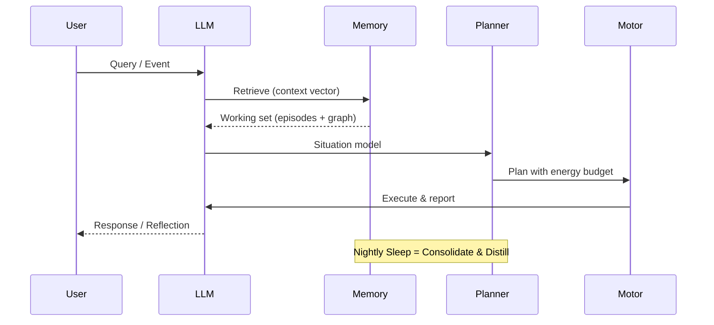

Got you. Here’s a **GitHub-ready Markdown** version (works in the web editor). It uses normal Markdown + fenced code blocks (including `mermaid`)—no HTML `<head>` or scripts needed. **Copy-paste this directly into your README.md (or BRAINneuralMemory.md).**

---

# 🧠 BRAIN — BruceAI Neural Memory + Motor

**Tagline:** *Talk like a poet. Think like a pilot. Remember like a parent. Move like a motor.*

**Status:** Fully deployable design blueprint — ambitious but practical.
**License:** MIT · **Ethics:** `ETHICAL_USE.md` · **Author:** Jonny G (Joker Jonny / Hackpen)

---

## TL;DR — No Fluff

* **Store:** *Episodes* (what / where / when) · *Semantics* (facts / relations) · *Skills* (policies) · *Valuation* (salience / reward)
* **Retrieve:** “Laser Cortex” → vector search → attention pool → graph hops → situation model
* **Reason / Plan:** in latent space (not tokens) with a lightweight world model; repeated plans → skills (reflex policies)
* **Energy:** treat compute + latency + cost as ATP; planner budgets for it
* **Sleep:** nightly consolidation, pruning, and distillation
* **LLM = Interface + Tool-Use** · **World Model + Memory + Planner = Brain**

---

## Why This Exists

Chat logs aren’t memory. Token prediction isn’t physics.

If BruceAI is going to *feel alive—present, useful, and sane*, it needs a real **brain**: a persistent multimodal memory, a latent-world model to imagine futures, a planner to choose actions, and a motor that budgets energy.

**Design goal:** when something happens — “child jumps into the pool” — BRAIN lights up similar memories, predicts likely outcomes, chooses a plan (towel / camera / safety), acts, and learns — fast.

---

## System at 10,000 ft

```mermaid
flowchart LR
  subgraph Perception
    A[Text · Audio · Video · Sensors]
    E[Encoders<br/>CLIP · Whisper · ViT]
  end

  subgraph Memory
    V[(Vector Store<br/>pgvector · LanceDB)]
    G[(Graph DB<br/>Neo4j)]
    O[(Object Store<br/>S3 / FS)]
  end

  subgraph Working
    R[Attention Pool<br/>+ Hopfield Update]
    S[Situation Model<br/>(Latent State)]
  end

  subgraph Cognition
    W[World Model<br/>(Latent Dynamics)]
    P[Planner<br/>MPC · CEM · Beam]
    K[Skills<br/>(Policy Graphs)]
  end

  subgraph Motor
    C[Controllers & Tools<br/>(ffmpeg · search · agents)]
    M[Energy Budgeter<br/>(cost · latency · quotas)]
  end

  A --> E --> V
  E --> O
  V <--> R
  G <--> R
  R --> S --> W --> P
  K <--> P
  P --> C
  M -- constraints --> P
  C --> O
  P --> V
  P --> G
```

> **Note:** The LLM sits *beside* this graph as the conversational/controller layer. It frames goals, calls retrieval + planning APIs, and explains outcomes. It is **not** the physics brain.

---

## Core Data Model

**One spine, two sidecars — simple, scalable, durable.**

### Spine: Postgres (+ pgvector ≥ 0.5)

```sql
CREATE EXTENSION IF NOT EXISTS vector;

CREATE TABLE IF NOT EXISTS events (
  id UUID PRIMARY KEY,
  t timestamptz NOT NULL,
  who TEXT[],
  what TEXT[],
  where_ TEXT[],
  context JSONB,
  importance REAL DEFAULT 0.0,
  reward REAL DEFAULT 0.0,
  outcome TEXT,
  embedding vector(1024)
);

CREATE INDEX IF NOT EXISTS events_embedding_hnsw
  ON events USING hnsw (embedding vector_cosine_ops)
  WITH (m = 16, ef_construction = 64);

CREATE INDEX IF NOT EXISTS events_t_idx ON events (t);

CREATE TABLE IF NOT EXISTS snippets (
  id UUID PRIMARY KEY,
  event_id UUID REFERENCES events(id) ON DELETE CASCADE,
  modality TEXT CHECK (modality IN ('text','audio','image','video')),
  uri TEXT NOT NULL,
  span JSONB
);

CREATE TABLE IF NOT EXISTS skills (
  id UUID PRIMARY KEY,
  name TEXT UNIQUE,
  description TEXT,
  pre JSONB,
  steps JSONB,
  post JSONB,
  embedding vector(768),
  uses INT DEFAULT 0,
  success REAL DEFAULT 0.0
);

CREATE TABLE IF NOT EXISTS metrics (
  key TEXT PRIMARY KEY,
  val JSONB,
  updated timestamptz DEFAULT now()
);
```

**Tip:** after bulk loads → `ANALYZE events;`
For queries → `SET hnsw.ef_search = 80;` (tune recall/latency)

### Sidecar A: Graph (Neo4j / Memgraph)

```cypher
CREATE CONSTRAINT person_name IF NOT EXISTS
FOR (p:Person) REQUIRE p.name IS UNIQUE;

CREATE INDEX idea_name IF NOT EXISTS
FOR (i:Idea) ON (i.name);

CREATE INDEX rel_similar_weight IF NOT EXISTS
FOR ()-[r:SIMILAR]-() ON (r.weight);
```

**Nodes:** Person, Place, Object, Idea, Skill
**Edges:** KNOWS, LOCATED_IN, CAUSES, PART_OF, USED_FOR, SIMILAR
**Properties:** weight, t_first, t_last, source

### Sidecar B: Object Store

* Raw artifacts (audio / video / images / text)
* Content-addressed via SHA-256
* Referenced by `snippets.uri`

---

## Memory Types

| Type                      | Description                                              |
| ------------------------- | -------------------------------------------------------- |
| **Episodic**              | Time-stamped events with embeddings + media refs         |
| **Semantic**              | Graph facts about people / places / objects / ideas      |
| **Procedural**            | Named policy graphs (pre → steps → post) with embeddings |
| **Affective / Valuation** | Importance · Reward · Salience · Recency Decay           |

**Rule:** Every write must update ≥ 1 of each — episode, facts, or skills — so the system always has a scene, meaning, and a way to act.

---

## Retrieval — The Laser Cortex

Mass-parallel content-addressable recall — like shining a beam into a sphere of cells.

### Steps

1. Top-K per modality from `events.embedding` given the current cue (text / image / audio).
2. Cross-episode attention (Hopfield update) → settle on a working set.
3. Graph hops (2–3) from entities in the set → causal neighbors.
4. Affect gating: boost by `importance × salience × recency`.
5. Situation model (latent): compress the set → compact state for planner.

### Retrieval Score (example)

```sql
SELECT id,
  0.55 * (1 - (embedding <=> :q)) +       -- cosine similarity
  0.20 * GREATEST(0, 1 - EXTRACT(EPOCH FROM (now() - t)) / 86400.0 / 30) +
  0.15 * COALESCE(importance, 0) +
  0.10 * COALESCE(reward, 0) AS score
FROM events
ORDER BY score DESC
LIMIT 50;
```

---

## Reasoning & Planning (Latent System-2)

* Use latent world model **W** for rollouts and hypothesis testing.
* Use planner **P** (MPC / CEM / beam) to evaluate cost vs reward.
* Compile repeated plans into **Skills** (policy graphs).
* Reasoning loop = retrieval → simulation → plan → action → feedback.

*All compute, latency, and API costs are treated as energy. Planner budgets like metabolism.*

---

## Energy-as-Motor

* **Energy Budgeter (M):** tracks compute time + token cost + latency.
* **Controllers (C):** run plans via tools, agents, or external calls.
* **Motor Loop:** plan → budget → execute → learn → refine.
* If budget violated → system backs off (“fatigue”).

---

## Sleep / Dreaming / Consolidation

1. **Replay** recent episodes by importance & salience.
2. **Cluster** similar embeddings → compress memory.
3. **Distill** repeated plans into skills.
4. **Prune** low-reward / redundant entries.
5. **Re-index** vector / graph stores for speed.

*Sleep reduces entropy. Dreaming is compression.*

---

## APIs (v0)

| Method | Path        | Purpose                                            |
| ------ | ----------- | -------------------------------------------------- |
| `POST` | `/retrieve` | cue → episodes + graph expansion → situation model |
| `POST` | `/plan`     | situation model → plan steps (+ energy budget)     |
| `POST` | `/execute`  | plan → controllers / tools → outcomes              |
| `POST` | `/sleep`    | consolidate → prune → distill skills               |

---

## Reference Pipeline



---

## Repo Layout

```
brain/
  api/
    server.py
    routes/
      retrieve.py
      plan.py
      sleep.py
  core/
    memory/
    planner/
    motor/
  data/
  tests/
docs/
  images/
  diagrams/
```

---

## Quickstart

```bash
python -m venv .venv && source .venv/bin/activate  # Windows: .venv\Scripts\activate
pip install -r requirements.txt
uvicorn brain.api.server:app --reload
```

---

## Eval & Telemetry

* **Metrics table** logs usage / success / energy.
* Periodic self-tests: retrieval precision, plan success rate, energy per reward.
* Privacy: all telemetry local by default; remote opt-in only.

---

## Security & Privacy

* AES-256 encrypted object store (offline optional).
* Role-based API keys for memory writes.
* `ETHICAL_USE.md` enforced on startup.
* Nightly scrub for PII and token leakage.

---

## Legal / Ethical Use

BruceAI must never be used to deceive, surveil, or exploit.
All derivative systems must retain `ETHICAL_USE.md` and respect human agency.

---

## Roadmap

| Phase | Goal                              | Deliverable                              |
| ----- | --------------------------------- | ---------------------------------------- |
| 1     | Core Memory Spine + Vector Search | Working pgvector + Neo4j stack           |
| 2     | Laser Cortex Retrieval API        | Attention pool + graph hops              |
| 3     | Latent Planner / Energy Motor     | End-to-end loop (simulate → act → learn) |
| 4     | Sleep + Dream Cycle               | Consolidation + Skill Distillation       |
| 5     | Full Neural Memory Kernel         | Continuous learning brain runtime        |

---

## Contributing

PRs welcome if you understand the ethic and the architecture.
Read `ETHICAL_USE.md` first. Violations = ban.
Style guide: clarity > cleverness. Truth > trend.

---

**Final Note:** *This document is not science fiction. It’s a map of how digital cognition can be built ethically, coherently, and consciously. The rest is just code.*
